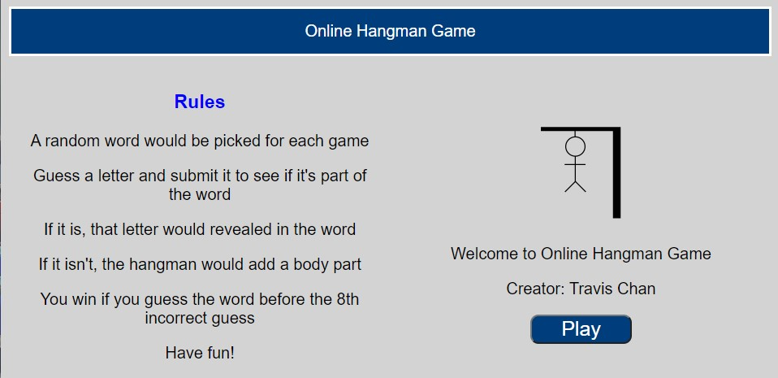
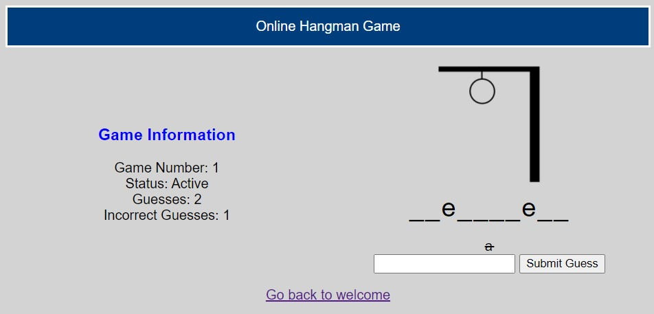

# Online Hangman
<p align='center'>
  
</p>

An online hangman game using Spring Boot REST API.
Play hangman with a long list of words on a simple and nice looking website.
Win by guessing the word before the 8th incorrect guess.

## Installation
1. Download, install and run [IntelliJ Community Edition](https://www.jetbrains.com/idea/download/)
2. Click "Get from VCS" or File->New->Project From Version Control
3. Insert the following URL:
```
https://github.com/Toooo123/Online-Hangman.git
```
4. Run Application
5. Open this URL on your web browser.
```
localhost:8080/welcome
```

## Game Information
### Rules
A random word would be picked for each game.
Guess a letter and submit it to see if it's part of the word.
If it is, that letter would be revealed in the word.
If it isn't, the hangman would add a body part.
You win if you guess the word before the 8th incorrect guess.
Have fun!

### Random Words
Words are chosen in [commonWords.txt](src/commonWords.txt).
You may add or remove words by modifying the text file.


## Sample Images
### Home Screen


### In Progress Screen


### Win Screen


### Lose Screen
